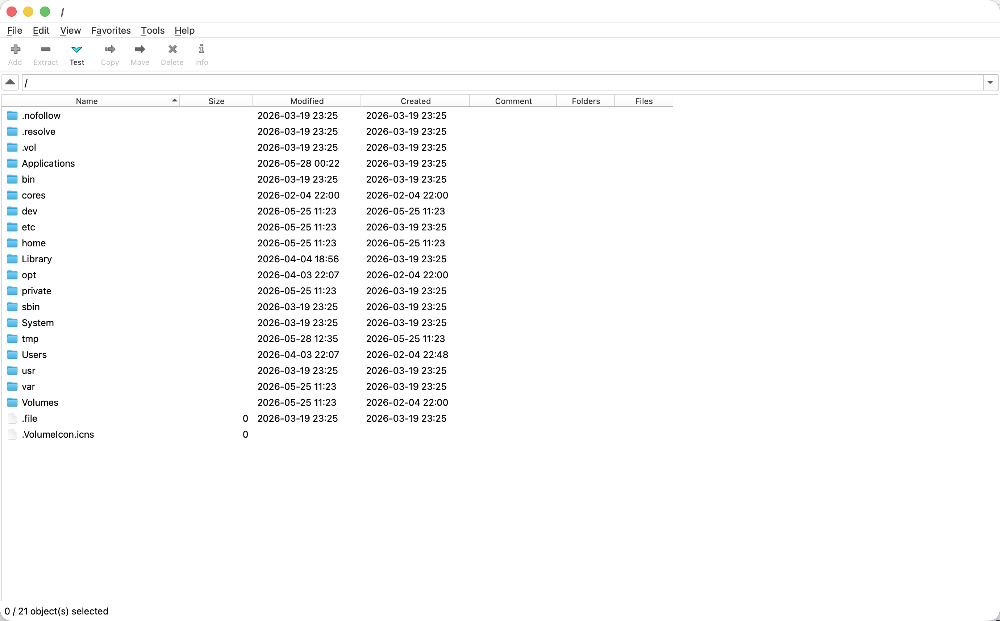
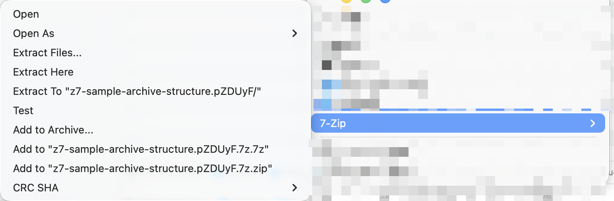
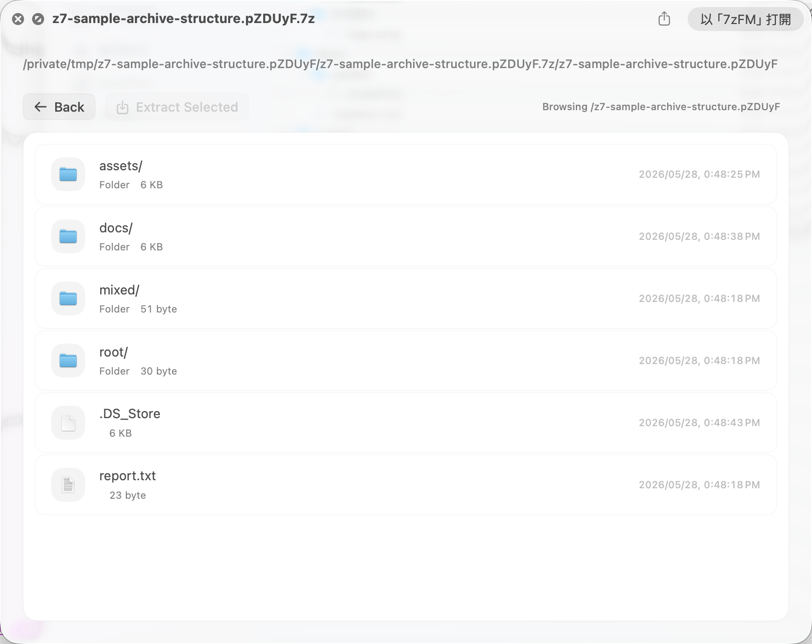
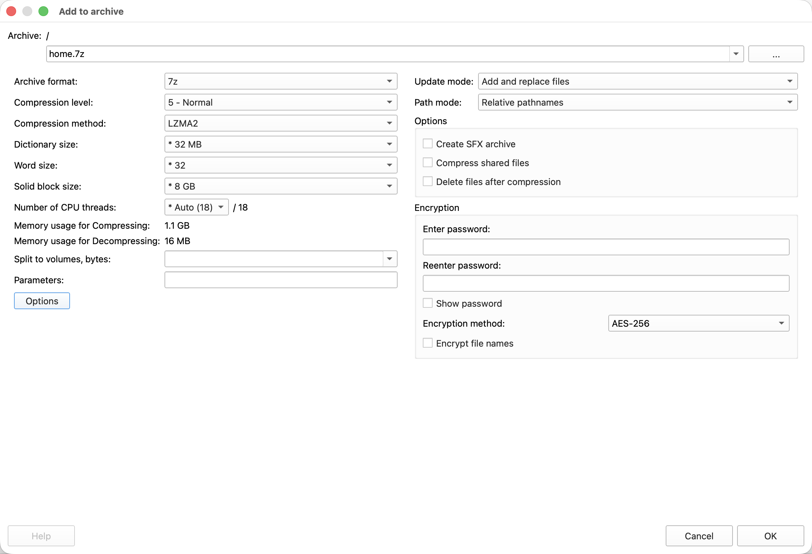
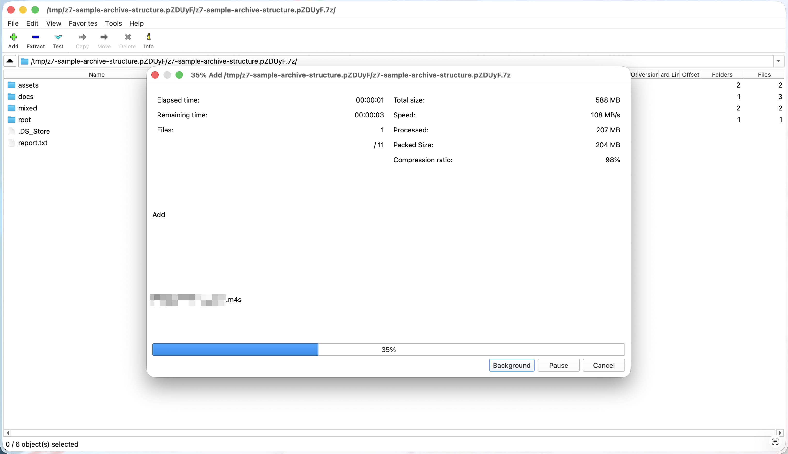
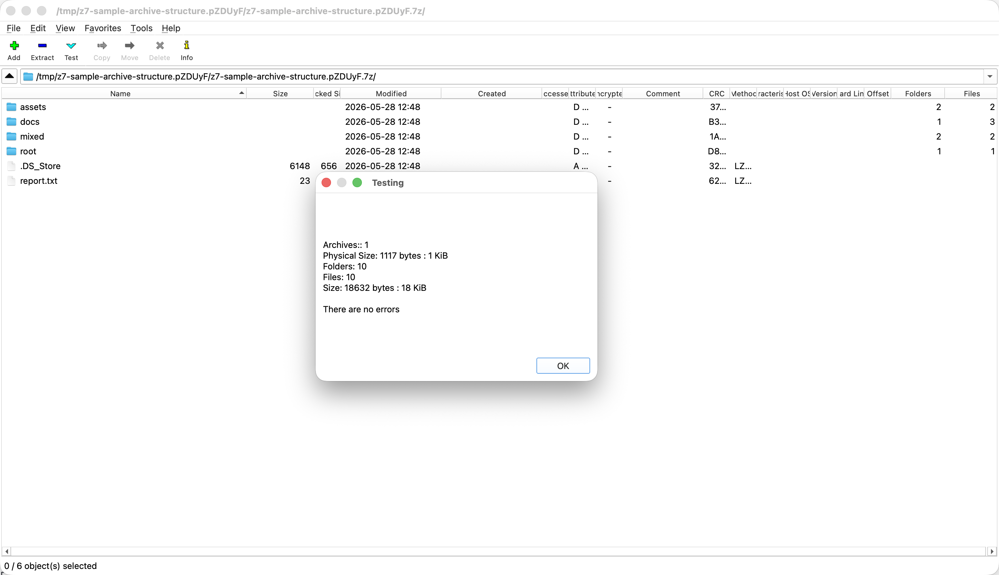
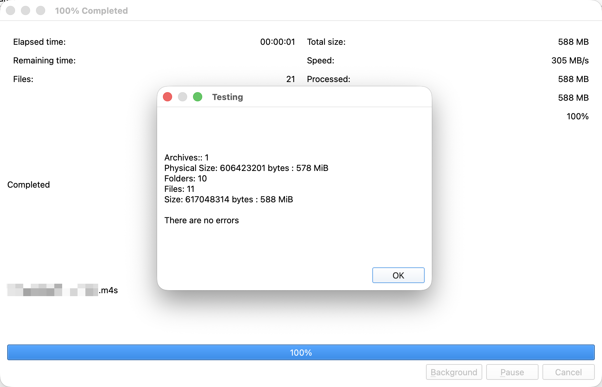
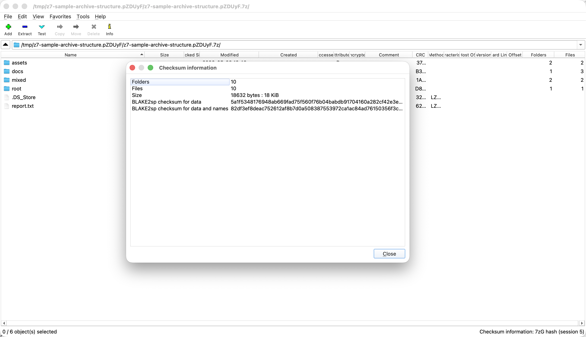

# 7z GUI Qt

A Qt port of the 7-Zip, with Mac OS extra features: Finder Sync, Quick Look.

This repository is primarily developed and validated on Mac OS.

## Pictures

















## Highlights

- Finder Sync actions for compress, extract, test, and CRC from the macOS context menu.
- Quick Look previews and extract for archive contents without opening the full app.
- 7zG add, extract, test, and CRC windows launched from 7zFM or shell integration.
- Qt/native drag/drop with Mac OS native file handling.

## Build

```sh
brew install llvm clang # Recommended, without these may not build, needs verification.

brew install qt # Required for Qt build and run without bundled .app. 
# Homebrew Qt currently required for every sfx run since sfx file will exist on the system without installing the app bundle.

cmake --preset {dev,release,release-native}
cmake --build --preset {dev,release,release-native}

cmake --build --preset {dev,release,release-native} --target deploy_macos # Generate .app bundle without extensions.
```
release-native preset builds with extra flags like `-march=native`.

The final .app bundle is: `build/{preset}/deploy/7zFM.app`.

Assemble final release of Finder Sync and Quick Look extensions to final app bundle with:

```sh
src/macos_integration/xcode_project/scripts/build.sh release # Build Finder Sync and Quick Look extensions

packaging/macos/copy_xcode_extensions.sh # Copy the built extensions (release) to the CMake app bundle and sign.
```
